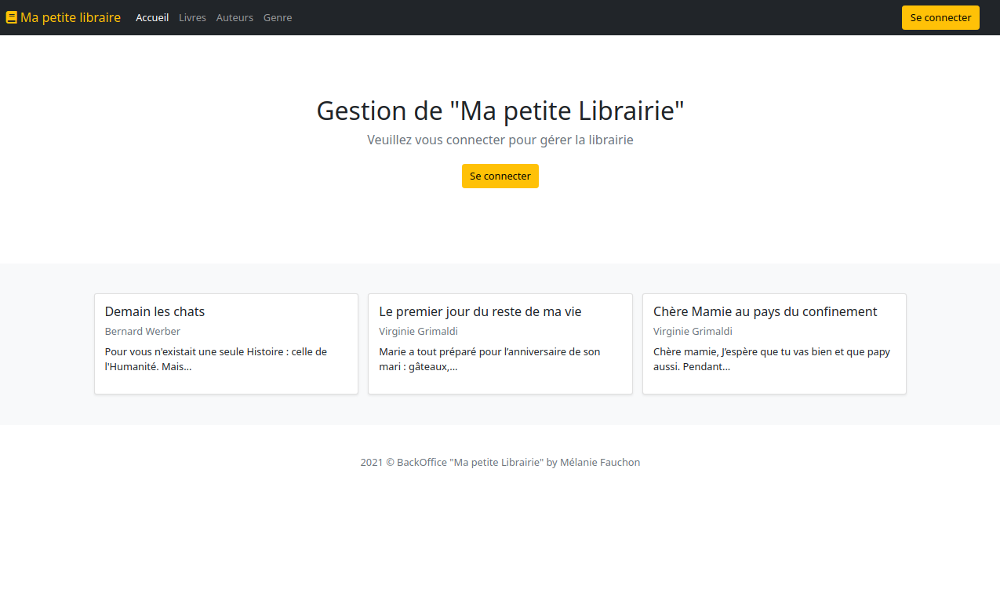
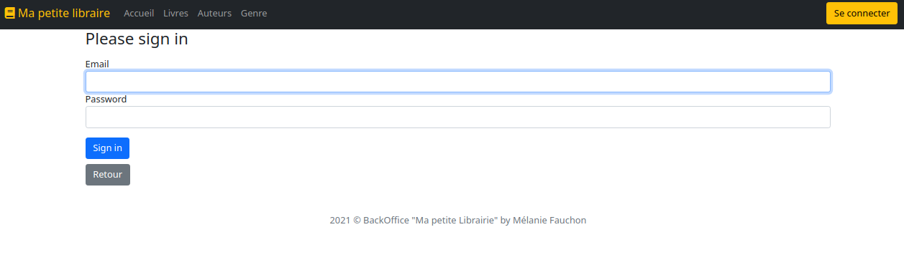
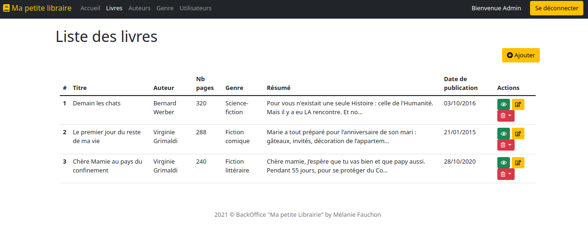

# backoffice

Création d'un panneau d'administration pour la gestion d'une librairie.

Réalisé avec Symfony 5.3.9

## Aperçu de l'application 
<kbd></kbd>

<kbd></kbd>

<kbd></kbd>

## Pour faire fonctionner le projet

Après avoir cloné le repository, installez les dépendances : ``` composer install ```

Pour le stockage des informations : 
* Créez un fichier ``` .env.local ``` afin de configurer la base de données
* Créez la base de données avec : ``` bin/console doctrine:database:create ```
* Jouez les mmigrations avec : ``` bin/console doctrine/migration:migrate ```

Lancer un serveur local pour pouvoir explorer l'application